<p align="center">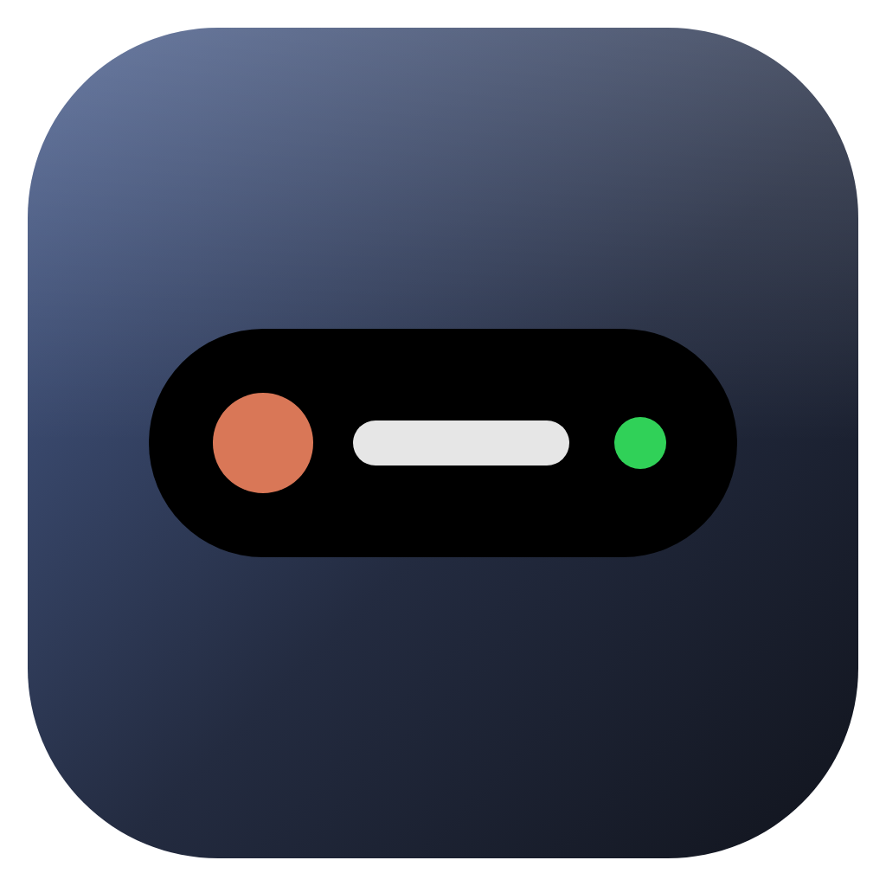</p>

# Dynamic Island para Windows

Una isla negra al estilo del iPhone para Windows 10 y 11. Vive arriba de la pantalla, se asoma al pasar
el ratón y se expande con todo lo que importa en ese momento: la música que suena, lo que están haciendo
tus agentes de IA (Claude Code, Codex, tu IA local), el pomodoro, el sistema y algunas utilidades rápidas.

Hecha con **Tauri 2 + Rust + React + TypeScript + Framer Motion**. Pensada para gastar lo mínimo:
en reposo usa ~0 % de CPU y ~96 MB de RAM, y ningún módulo consulta nada si está apagado.

> Versión 0.2.0 · Windows 10/11 x64 · Interfaz en español.

<p align="center">
  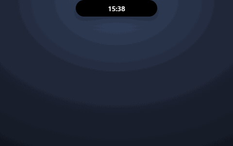
</p>
<p align="center">
  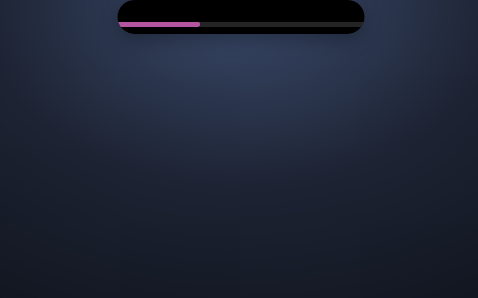
  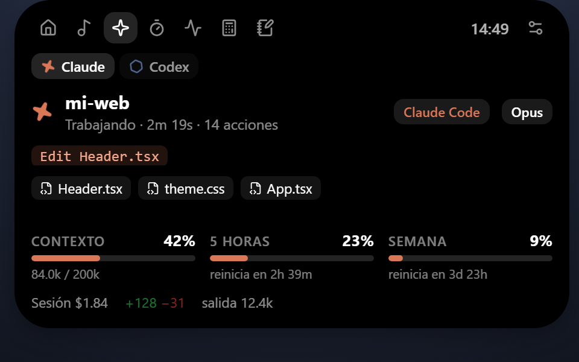
</p>

> Todas las capturas usan datos de ejemplo (se generan con `scripts/capture-docs.mjs`).

---

## Qué hace

### La isla
- **Tres estados con animación fluida:** cerrada (una píldora pequeña), asomada (al pasar el ratón) y
  expandida (panel con pestañas). Un clic la deja abierta hasta que sacas el ratón.
- **Arrastrar e imantar:** suéltala arriba o en un lateral del monitor que quieras y se pega al borde.
  Recuerda su posición en cada monitor.
- **Varios monitores:** una isla por monitor, todas sincronizadas. Cada monitor puede **fijar qué enseña**
  (agentes IA, temporizador, música o automático): por ejemplo, el pomodoro en una pantalla y los agentes
  en otra.
- **Estado mínimo:** con un vídeo o un juego a pantalla completa se encoge a una barrita fina para no molestar.
- **Actividades en vivo:** lo más importante ocupa la píldora (un agente pidiendo permiso > un agente
  trabajando > un temporizador > la música) y lo segundo aparece como indicador al lado.
- **Píldora ampliada:** en el monitor principal (o en todos, configurable) la píldora cerrada crece hacia
  abajo para enseñar el detalle de los agentes sin tener que expandirla.
- Fuera de Alt+Tab y de la barra de tareas; vive en la bandeja del sistema. Una sola instancia.

| Cerrada | Asomada (ratón encima) | Mínima (pantalla completa) |
| --- | --- | --- |
|  |  |  |

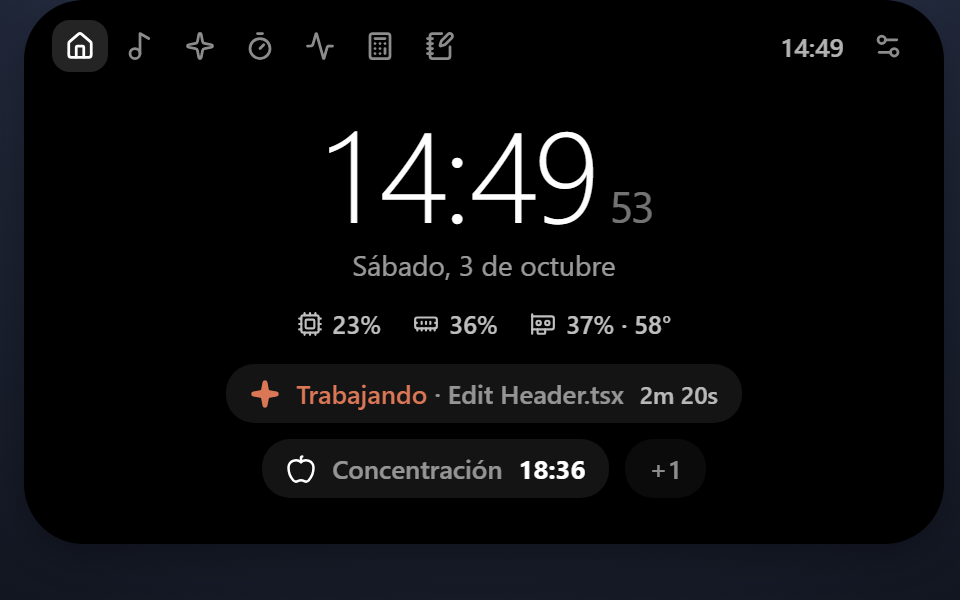

### Música y audio
- Canción, artista, carátula y progreso de **cualquier app que use los controles multimedia de Windows**
  (Spotify, YouTube en Chrome/Edge, etc.), con los colores de la carátula.
- Play/pausa, anterior, siguiente y saltar en la barra de progreso.
- Volumen, silencio y cambio de salida de audio (altavoces, auriculares...) desde la isla.

| Píldora con música | Panel de música |
| --- | --- |
|  |  |

### Agentes de IA
Varios agentes a la vez: con uno activo la píldora enseña su detalle; con varios, **una fila por agente**.

| Agente | Cómo se conecta | Qué enseña |
| --- | --- | --- |
| **Claude Code** | Hooks HTTP y statusLine a un puerto local (instalador incluido) | Trabajando / necesita tu permiso / listo, acción en curso, archivos tocados, tiempo del turno, contexto, límites de 5 h y semanal, coste |
| **Codex** (app y CLI) | Lee sus archivos de sesión (`~/.codex/sessions`) | Trabajando / listo, acción en curso, archivos editados, tiempo, contexto, límite de uso de tu plan |
| **IA local** (Bionic, LM Studio, Ollama) | Su API HTTP en un endpoint configurable | Modelo cargado, "generando" (deducido del uso de la GPU), uso de GPU, contexto cargado |

| Un agente (píldora ampliada) | Pidiendo permiso |
| --- | --- |
| 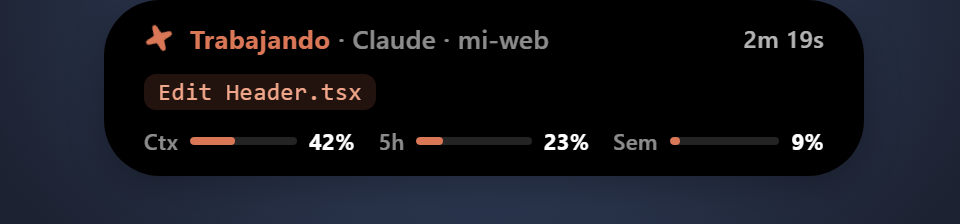 | 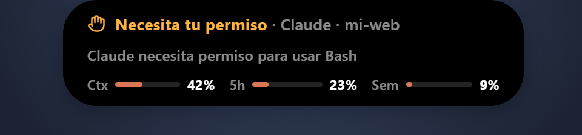 |

| Varios agentes + pomodoro | Agente + pomodoro |
| --- | --- |
| 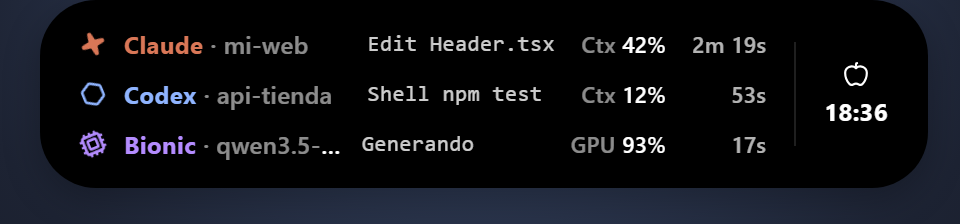 | 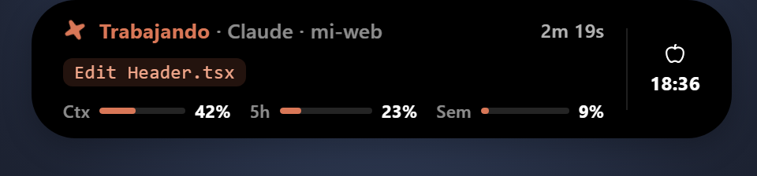 |


Monitor fijado a **Temporizador**: el pomodoro va delante aunque Claude esté trabajando (icono a la derecha).


### Sistema y utilidades
- **CPU, RAM y GPU** (NVIDIA por NVML: uso, VRAM, temperatura). Solo se consultan con el panel abierto.
- **Pomodoro, cuenta atrás y cronómetro.** Siguen contando con la isla cerrada y avisan con un sonido.
- **Calculadora** y **notas rápidas** que se guardan solas.
- **Ajustes** en su propia ventana: colores, opacidad, tamaño, retardos, atajos, módulos, monitores y
  arranque con Windows.

| Temporizadores | Sistema |
| --- | --- |
| 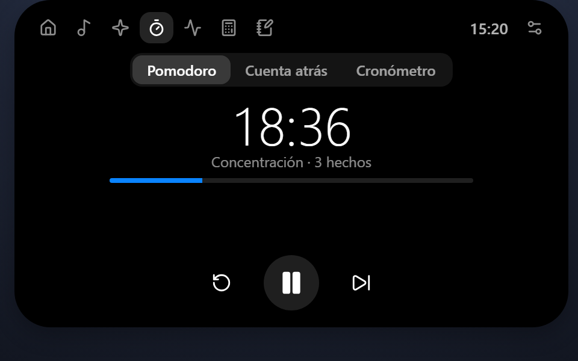 | 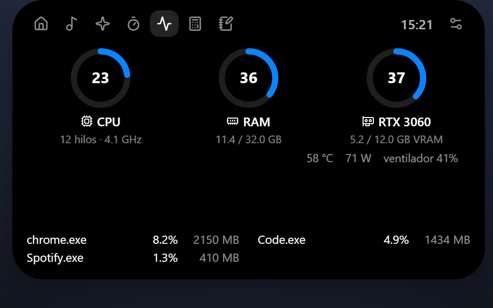 |

| Calculadora | Notas |
| --- | --- |
| 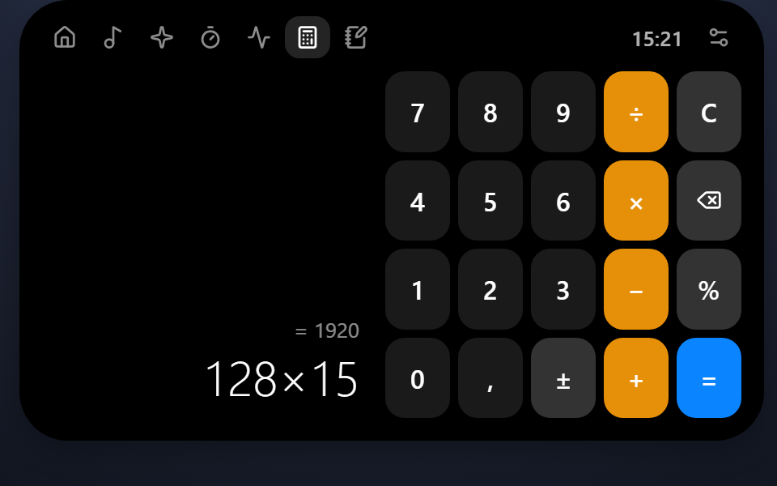 | 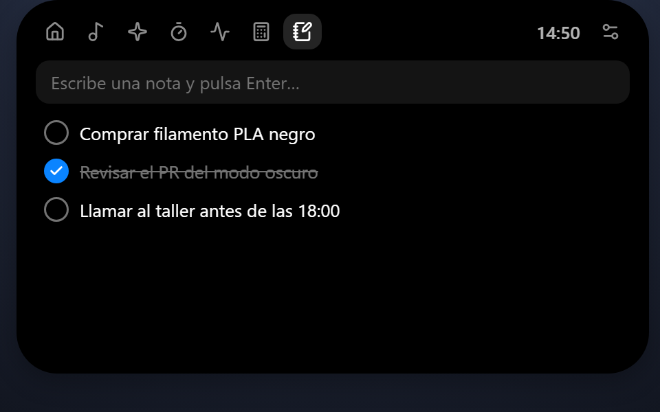 |

### Ajustes

Aspecto, posición y monitores (con qué enseña cada uno), módulos, IA local, atajos y arranque con Windows.

<details>
<summary>Ver la ventana de ajustes completa</summary>

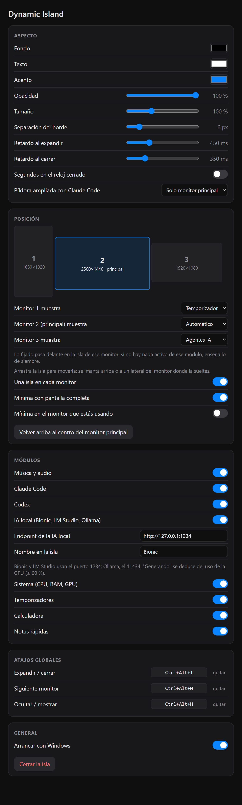

</details>

---

## Instalar

1. Descarga `Dynamic Island_0.2.0_x64-setup.exe` de la página de *Releases*.
2. Ejecútalo. El instalador no está firmado: si Windows SmartScreen avisa, pulsa
   **Más información → Ejecutar de todas formas**.
3. La isla aparece arriba al centro del monitor principal. Para que arranque sola:
   **Ajustes → General → Arrancar con Windows**.

Necesita **WebView2**, que ya viene con Windows 10 (actualizado) y Windows 11.

## Uso

| Acción | Cómo |
| --- | --- |
| Asomar / expandir | Pasa el ratón por encima (se expande tras un instante) |
| Dejarla abierta | Clic en la isla |
| Moverla | Arrástrala y suéltala arriba o en un lateral de cualquier monitor |
| Expandir / cerrar | `Ctrl+Alt+I` |
| Pasar al siguiente monitor | `Ctrl+Alt+M` |
| Ocultar / mostrar | `Ctrl+Alt+H` |
| Ajustes | Engranaje de la isla expandida o icono de la bandeja |

Los atajos se cambian en Ajustes. Los ajustes se guardan en
`%APPDATA%\com.dallamond.dynamicisland\settings.json`.

## Conectar los agentes

### Claude Code
Con [Node.js](https://nodejs.org) instalado, desde la carpeta del proyecto:

```bash
node scripts/install-claude-hooks.mjs            # instala
node scripts/install-claude-hooks.mjs --uninstall  # lo revierte
```

Añade a `~/.claude/settings.json` unos hooks HTTP hacia `127.0.0.1:47823` y un statusLine que
reenvía el uso de tokens y límites (hace copia de seguridad antes de tocar nada). Con la isla
cerrada los hooks fallan en silencio y Claude Code sigue funcionando igual.

### Codex
No hay que instalar nada: con el módulo **Codex** activado la isla lee la sesión más reciente de
`~/.codex/sessions` (o de `%CODEX_HOME%`). Codex no deja en esos archivos cuándo te pide permiso,
así que para Codex no existe el aviso de "necesita tu permiso".

### IA local (Bionic, LM Studio, Ollama)
Activa **Ajustes → Módulos → IA local** y pon el endpoint del servidor:

| Servidor | Endpoint por defecto |
| --- | --- |
| Bionic / LM Studio | `http://127.0.0.1:1234` |
| Ollama | `http://127.0.0.1:11434` |

En "Nombre en la isla" puedes poner cómo quieres que aparezca (p. ej. *Bionic*). Ninguna de estas APIs
avisa de cuándo está generando, así que la isla lo deduce del uso de la GPU (≥ 60 % durante unos 4 s).
Si juegas o renderizas con el modelo cargado, también lo verá como "generando".

## Privacidad

- Todo es local: la isla no se conecta a internet.
- No lee credenciales: ni `~/.claude`, ni `~/.codex/auth.json`, ni claves de API de servidores locales.
- El único puerto que abre es `127.0.0.1:47823` (solo accesible desde tu propio equipo) para los hooks
  de Claude Code.

## Consumo

Medido en un Ryzen 5 3600 con RTX 3060 y tres monitores (build release):

| Escenario | RAM privada | CPU media |
| --- | --- | --- |
| 1 isla cerrada | 96 MB | 0,01 % |
| 1 isla animando | 135 MB | 1,46 % |
| 3 islas (una con el panel de sistema abierto) | 197 MB | 0,11 % |

Casi toda la RAM es de WebView2. Se arranca sin aceleración por GPU: así gasta menos y la transparencia
funciona igual. Detalle en [`docs/ROADMAP.md`](docs/ROADMAP.md#registro-de-mediciones).

---

## Compilar desde el código

Requisitos: [Node.js](https://nodejs.org) 20+, [Rust](https://rustup.rs) estable y los
[requisitos de Tauri 2 para Windows](https://v2.tauri.app/start/prerequisites/) (WebView2 y,
con la toolchain MSVC, las Build Tools de Visual Studio).

```bash
npm install
npm run tauri dev     # desarrollo con recarga en caliente
npm run tauri build   # ejecutable + instalador NSIS en <target>/release/bundle/nsis/
cd src-tauri && cargo test
```

Funciona con la toolchain **MSVC** (la normal) o con **GNU** (`x86_64-pc-windows-gnu` + MinGW-w64).
Con GNU hay dos detalles: el `crate-type` es solo `rlib` porque un `cdylib` supera el límite de 65535
exports de MinGW, y `windres` no admite espacios en las rutas, así que conviene compilar con
`CARGO_TARGET_DIR` apuntando a una carpeta sin espacios.

### Capturas de la documentación

Las imágenes de `docs/img` salen de la app real con el backend simulado y datos de ejemplo:

```bash
npm run dev                         # en otra terminal
node scripts/capture-docs.mjs       # todas las escenas (o: node scripts/capture-docs.mjs media peek)
```

El GIF de la cabecera se graba con `node scripts/record-gif.mjs` (necesita `npm i --no-save puppeteer-core gifenc pngjs`).

`demo.html?scene=<escena>` abre cualquier escena en el navegador. El icono y las imágenes del instalador
salen de `brand/` (`icon.svg` y `render.html`); los iconos se regeneran con `npx tauri icon brand/icon.png`.

### Estructura

```
src/                     Frontend (React + TypeScript)
  island/                La isla: estados, tamaños y animaciones
  modules/               Un componente por módulo (agent, media, timer, system, calc, notes...)
  core/                  Actividades en vivo, IPC con Rust, tipos y stores
  settings/              Ventana de ajustes
src-tauri/src/           Núcleo en Rust
  window/                Ventanas, monitores, hover (un hilo consulta el cursor cada 50 ms), pantalla completa
  providers/             Un proveedor por módulo: media (SMTC), audio (WASAPI), agent (Claude Code),
                         codex, localai, system (sysinfo + NVML), timers, notes
  settings.rs            Ajustes persistentes
scripts/                 Instalador de hooks de Claude Code y statusLine
docs/                    Hoja de ruta, mediciones, pruebas, referencias y capturas (docs/img)
brand/                   Icono y arte del instalador
src/demo/                Demo con backend simulado para las capturas
```

Reglas de diseño: un módulo es un proveedor en Rust más un componente en React; un módulo apagado no
consulta nada; la ventana nunca se oculta con `hide()`, se mueve fuera de pantalla para no parpadear.

## Hoja de ruta

Hecho: la isla, música, Claude Code, sistema y utilidades, multimonitor, instalador, Codex, IA local,
varios agentes a la vez y contenido fijo por monitor. Pendiente: aprobar permisos de Claude Code desde
la isla, avisos configurables, letras sincronizadas (LRCLIB), Google Calendar y notificaciones de Windows.
Ver [`docs/ROADMAP.md`](docs/ROADMAP.md).

## Licencia

[MIT](LICENSE) © 2026 Dallamond.

## Créditos

El código es propio. Se usaron como referencia de diseño varios proyectos de la comunidad; la lista y sus
licencias está en [`docs/REFERENCES.md`](docs/REFERENCES.md).
